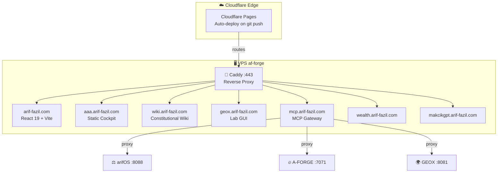

<!-- SOT-MANIFEST
federation_release: v2026.07.24
last_verified: 2026-07-24T08:00Z
live_commit: 58b0d77
scope: /root/arif-sites
epistemic_status: CLAIM
truth_rule: live git push + Cloudflare deploy beat any static count in prose
-->

# arif-sites — Static Surfaces & Domain Hosts

> **Status:** OPERATIONAL | **Organ:** SURFACE | **Authority:** arifOS
> **Domains:** `arif-fazil.com`, `arifos.arif-fazil.com`, `wiki.arif-fazil.com`, etc.

[](https://github.com/ariffazil/arif-sites/actions/workflows/audit.yml)
[](https://github.com/ariffazil/arif-sites/actions/workflows/deploy.yml)
[](https://github.com/ariffazil/arif-sites/actions/workflows/playwright-audit.yml)
[](LICENSE)

## 🏛️ What this repo is

The static site hosting layer for the arifOS federation. Each subsite is aligned to a domain name and hosted via Cloudflare Pages (auto-deploy on `git push main`). VPS-hosted dynamic services use Caddy as a reverse proxy.

**arif-sites owns the SURFACE — the observable face of every federation domain.**



## ⚡ Quick Start

```bash
cd /root/arif-sites
# Build React subsites
cd sites/arif-fazil.com && npm install && npm run build
# Caddy routes: see deploy/Caddyfile
# Sites: https://arif-fazil.com, https://aaa.arif-fazil.com
```

## 📦 Ownership

- **Owns**: All static site content, React subsite builds, Cloudflare Pages deployment, VPS Caddy routing.
- **Does NOT own**: Application logic (AAA, GEOX), Kernel logic (arifOS).

## 🏗️ Current Structure

```
arif-sites/
├── sites/                    # Static frontends (hostname-aligned)
│   ├── arif-fazil.com/       # React 19 + Vite 8 (builds to dist/)
│   ├── aaa.arif-fazil.com/   # Static HTML
│   ├── arifos.arif-fazil.com/ # Static docs
│   ├── arifosmcp.arif-fazil.com/ # Legacy redirect → mcp.arif-fazil.com (do not use)
│   ├── geox.arif-fazil.com/  # Static lab/field GUI
│   ├── makcikgpt.arif-fazil.com/ # Static MakcikGPT surface
│   ├── wealth.arif-fazil.com/ # Static WEALTH surface
│   ├── wiki.arif-fazil.com/  # Static constitutional wiki
│   └── shared/               # Shared design system assets
├── apps/                   # Dynamic product UIs (VPS Docker)
├── services/              # Backend MCP kernel surfaces
├── infra/                # Constitutional manifests, domains map
│   └── config/           # Domain and routing configuration
├── scripts/             # Deployment and audit scripts
├── config/
│   └── opencode.json   # OpenCode agent configuration
└── deploy-vps.sh       # VPS deployment script
```

## 🚀 Verified Commands

```bash
# Static sites: no build step required

# React subsites:
cd sites/arif-fazil.com && npm install && npm run build

# Deploy: git push main → Cloudflare Pages auto-deploy
# VPS deploy (Caddy):
./deploy-vps.sh
scripts/deploy-site.sh <site-dir>
```

## 🔗 Federation Loop

- [arifOS](https://github.com/ariffazil/arifos) — Kernel (docs hosted at arifos.arif-fazil.com)
- [GEOX](https://github.com/ariffazil/geox) — Field (lab/field GUI at geox.arif-fazil.com)
- [AAA](https://github.com/ariffazil/AAA) — Body (session at aaa.arif-fazil.com)

---


---

## 🏛️ Federation

| Organ | Repository | Role | Port |
|-------|-----------|------|------|
| **arifOS** | [ariffazil/arifos](https://github.com/ariffazil/arifos) | Constitutional Kernel · F1-F13 | 8088 |
| **AAA** | [ariffazil/AAA](https://github.com/ariffazil/AAA) | Reality Console · A2A Gateway | 3001 |
| **A-FORGE** | [ariffazil/A-FORGE](https://github.com/ariffazil/A-FORGE) | Execution Shell | 7071 |
| **GEOX** | [ariffazil/geox](https://github.com/ariffazil/geox) | Earth Intelligence | 8081 |
| **WEALTH** | [ariffazil/wealth](https://github.com/ariffazil/wealth) | Capital Intelligence | 18082 |
| **WELL** | [ariffazil/well](https://github.com/ariffazil/well) | Human Readiness | 18083 |
| **arif-sites** | [ariffazil/arif-sites](https://github.com/ariffazil/arif-sites) | Public Surfaces | 443 |

## Federation Separation of Powers

| Layer | Role | Can | Cannot |
|-------|------|-----|--------|
| **ARIF** | Sovereign | Veto, approve, decide | Be overridden |
| **AAA** | State / Cockpit | Display, route, queue, register | Judge, execute, seal |
| **arifOS** | Judge | Issue SEAL/HOLD/VOID/SABAR | Execute mutations |
| **Domain Organs** | Witnesses | Compute and reflect evidence | Decide alone |
| **A-FORGE** | Executor | Build, deploy, mutate | Self-authorize |
| **arif-sites** | Public Surface | Host static surfaces, route domains | Adjudicate, compute |
| **VAULT999** | Ledger | Record immutable seals | Edit or delete history |

> AAA routes and displays. arifOS judges. Domain organs witness. A-FORGE executes. arif-sites hosts the surface. VAULT999 records. ARIF decides.

> **SOT:** 2026-07-24 — live surfaces match README claims
> **F13 authority:** F1-F13 floors, 888_JUDGE, and VAULT999 in `ariffazil/arifos`.

## 📄 Contributing

This repository operates under the arifOS Federation constitution (F1–F13).  
See [AGENTS.md](AGENTS.md) for the canonical boot sequence and agent operating rules.

## 📜 License

AGPL-3.0. See [LICENSE](LICENSE).

---

**DITEMPA BUKAN DIBERI** — Forged, Not Given.
